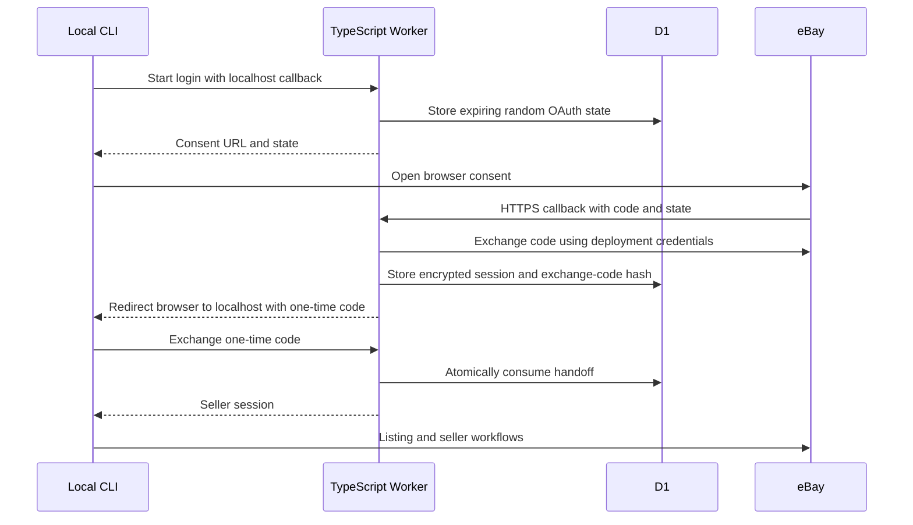

# Architecture

`ebaycli` is a local seller CLI. The TypeScript package in `cli/` owns listing and seller workflows. The TypeScript Worker in `backend/` is an optional reference implementation of the deployment-owned OAuth relay used by the current CLI.

## Responsibilities

| Component | Owns |
| --- | --- |
| Local CLI | Profiles, seller sessions, input files, output, listing plans, and direct Trading/Inventory calls |
| Deployment-owned relay | eBay app credentials, public OAuth callback, token exchange/refresh, legal pages, and notification endpoints |
| Cloudflare D1 | Short-lived OAuth state and encrypted seller-token handoffs |
| eBay | Consent, seller permissions, listing validation, and marketplace operations |

The particular Worker implementation is optional; a compatible relay is required for current CLI login and refresh. Direct app-secret configuration and a shared public app mode are not supported.

eBay uses an environment-specific RuName for its registered redirect settings. See [eBay authorization documentation](https://developer.ebay.com/develop/guides/sell/authorization) and the [deployment guide](deployment.md) for configuring those settings.

## Public relay contract

The CLI uses three JSON endpoints:

| Method and path | Purpose |
| --- | --- |
| `POST /api/local/ebay/authorize/start` | Create a consent URL for a production or sandbox environment and loopback callback |
| `POST /api/local/ebay/authorize/exchange` | Consume a one-time handoff and return a seller session |
| `POST /api/local/ebay/refresh` | Refresh a seller token while preserving local workflow defaults |

The browser callback is `GET /oauth/ebay/callback`. The registered declined endpoint, `GET /auth/declined`, also completes a pending login with an error when eBay supplies its state. Errors use HTTP status codes and a JSON problem object with `title`, `detail`, and `status`; revoked grants return HTTP 401 so the CLI can clear its local session and request reconnection.

The relay exposes public health, readiness, privacy, auth landing, agent metadata, and eBay notification endpoints. See the [backend README](../backend/README.md) for the full route list.

## State and credentials

- Each deployment supplies its own production and/or sandbox eBay app credentials as Worker secrets.
- The CLI stores seller access and refresh tokens in its local profile file. The on-disk filename is preserved for existing users; see [profiles](profiles.md).
- OAuth handoff tokens are encrypted with a deployment-owned AES-GCM key before temporary D1 storage. Exchange codes are hashed.
- Completed handoffs are consumed atomically. Expired state is removed by the scheduled cleanup.
- Normal listing operations call eBay from the CLI. Refresh still needs the configured relay.
- Notification POST endpoints acknowledge delivery. They do not reach into local machines to remove profile files or revoke sessions; eBay token failures drive local reconnection.

## Migrating from the .NET reference backend

The Worker keeps the login/exchange/refresh contract and eBay scope defaults. Existing local profile files require no migration. To move a deployment, use the same eBay app keyset and environment, configure its registered callback URLs for the new relay, then update `backendBaseUrl` through `ebay config set`.

Restart any login already in progress during the switch; temporary .NET auth-state rows are not imported into D1. Keep old infrastructure until the new relay has been verified with your account.

The former backend listing/setup compatibility endpoints are retired. Those workflows already live in the public CLI, which continues to call eBay directly. Consumers of the former private compatibility API must migrate to the CLI or maintain their own adapter.

## Contributor entrypoints

Start with the [code map](code-map.md), [contribution guide](../CONTRIBUTING.md), and [testing guide](../TESTING.md). The backend deploys to Workers and D1; it requires no .NET runtime, SQL Server, or container host.
